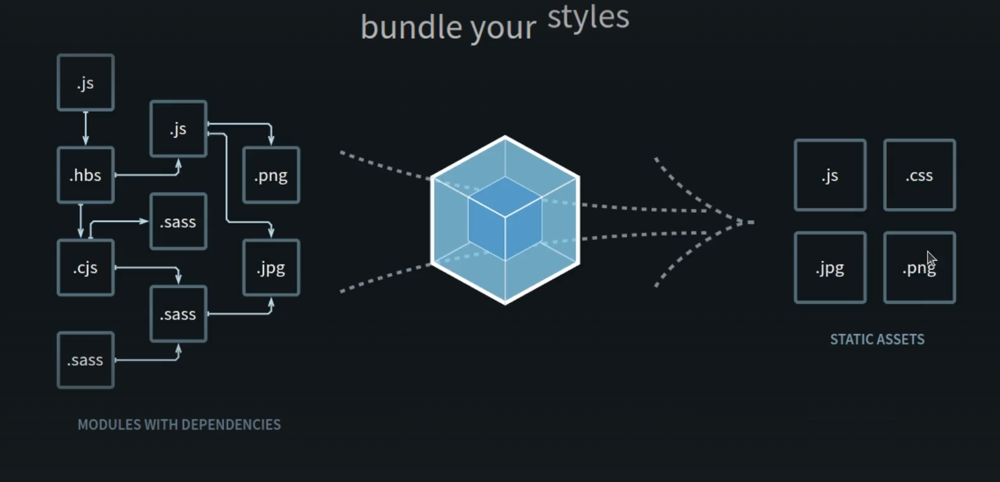

aula sobre webpack

empacotador de modulo estaticos

seu objetivo é empacotar todos os modulos de uma aplicação a partir de um ou mais pontos de entradas em um ou mais bundles, que são arquivos estaticos dcontendo tudo que aplicação precisa para funcionar

constroi um grafo de dependencias para os pontos de entrada, que permite saber exatamente quais moduilos sao necessarios

webpackjs.com

entry - ponto de entrada onde o webpack procurara por arquivos para empacotar
output - saida onde o webpack salvara os arquivos empacotados
loader - carregador que permite o webpack entender diferentes tipos de arquivos
plugin - plugin que permite o webpack fazer coisas mais complexas
mode - modo que define o modo de operação do webpack    

por que usar?

possiubilidade de trabalhar com modulos de forma facil, inclusive modulos CommonJS
possibilidade de automatizar o gerenciamente dois mosdulos e dependencias da aplicação
empacotar os modulos em arquivos estaticos permite que eles sejam servidos na web de forma facil e rapida
webpack é uma das soluçlões mais utilizadasd no mercado para gerenciamento de assets estaticos sendo utilizados por grandes empresas e framewirks populares como nexr.js, vue.js

comando para instalar 
npm install --save-dev webpack webpack-cli

intala o webpack e o webpack-cli como dependencias de desenvolvimento

